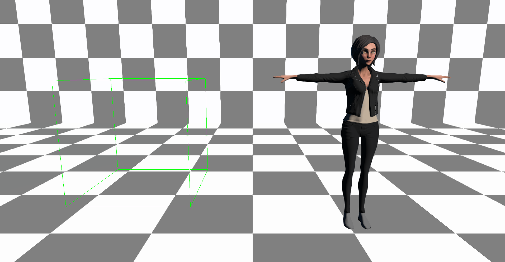

# Invalid/Valid URL Model Entity Create

### Preconditions
In an empty region of a domain with editing rights

### Description
This test creates a model with an invalid url and a model with a valid url

### Steps

#### Step 1
- run this [script URL](./create.js?raw=true) (from menu/Edit/Open and Run scripts From URL...). 
- expected: 