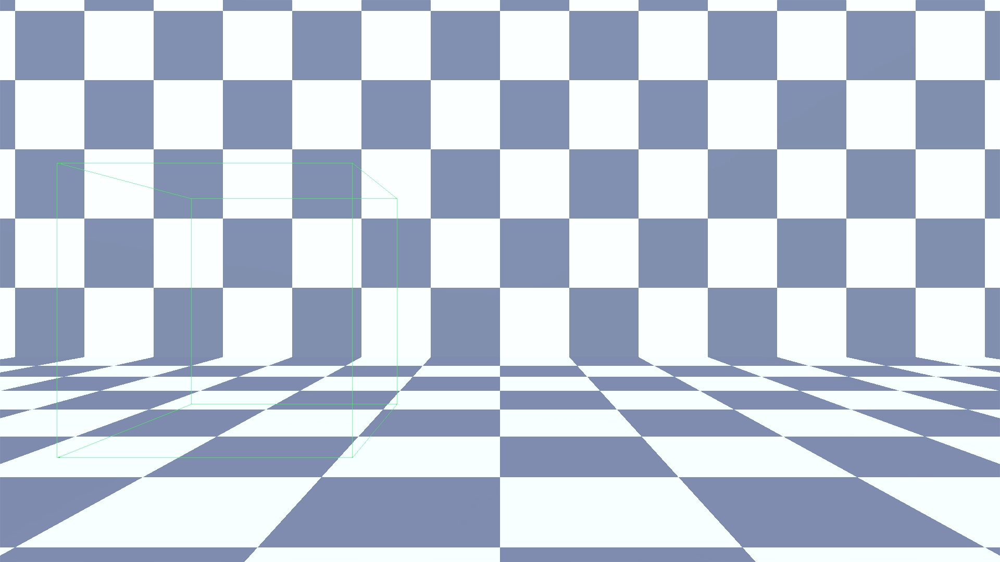
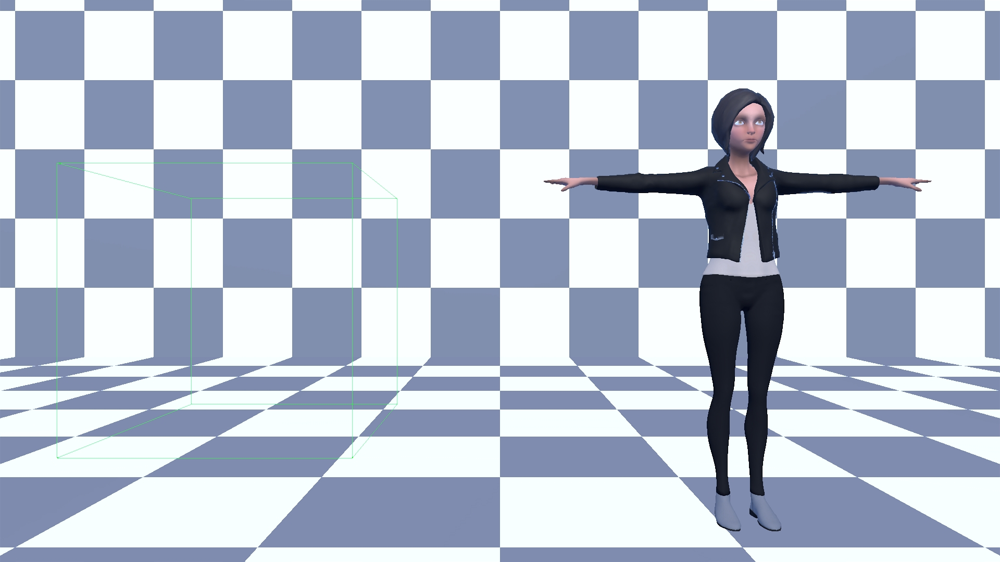

# Attempt to access invalid URL
## Run this script URL: [Manual](https://raw.githubusercontent.com/highfidelity/hifi_tests/master/tests/engine/render/geometry/invalidURL/test.js)   [Auto](https://raw.githubusercontent.com/highfidelity/hifi_tests/master/tests/engine/render/geometry/invalidURL/testAuto.js)(from menu/Edit/Open and Run scripts from URL...).

## Preconditions
- In an empty region of a domain with editing rights.

## Steps
Press 'n' key to advance step by step

### Step 1
- Attempt to load model with invalid URL
### Step 2
- Give models time to load
### Step 3
- Result of invalid URL load
- 
### Step 4
- Load model with valid URL
### Step 5
- Model is loaded
- 
### Step 6
- Clean up after test
