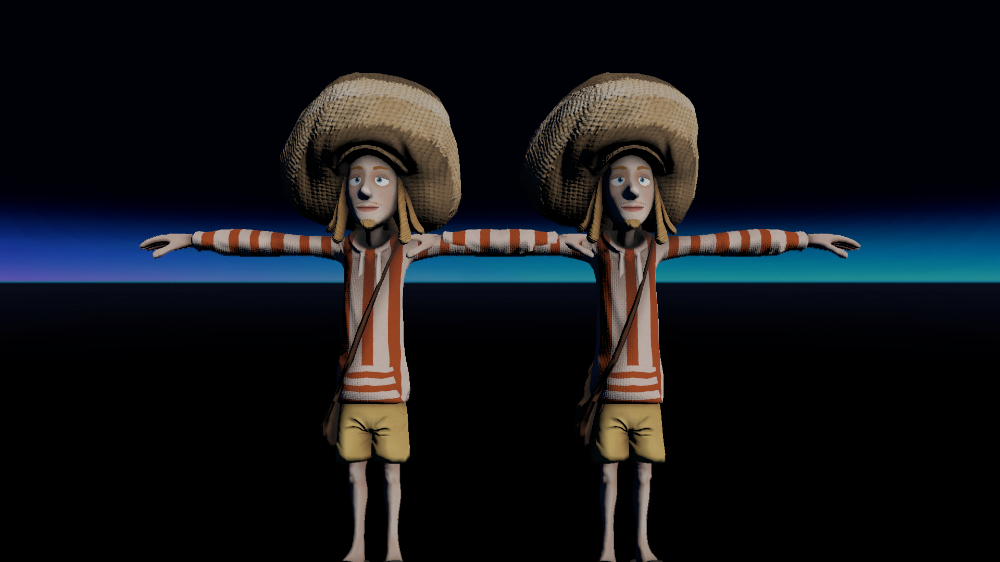

# LOD test
## Run this script URL: [Manual](./test.js?raw=true)   [Auto](./testAuto.js?raw=true)(from menu/Edit/Open and Run scripts from URL...).

## Preconditions
- In an empty region of a domain with editing rights.

## Steps
Press 'n' key to advance step by step

### Step 1
- Both models visible
- 
### Step 2
- Set LOD to 60
### Step 3
- Eyes of left model cannot be seen
- 
### Step 4
- Set LOD to 10
### Step 5
- Only left model visible
- 
### Step 6
- Set LOD to 4
### Step 7
- No models are visible
- 
### Step 8
- Clean up
