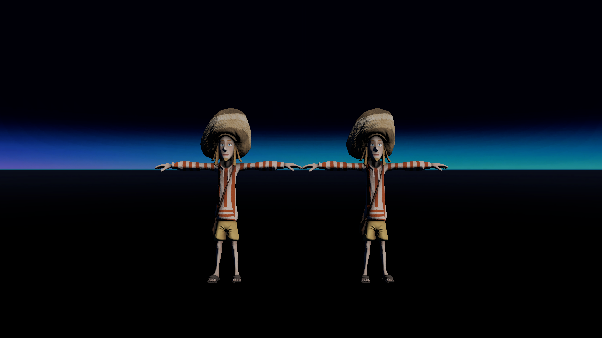
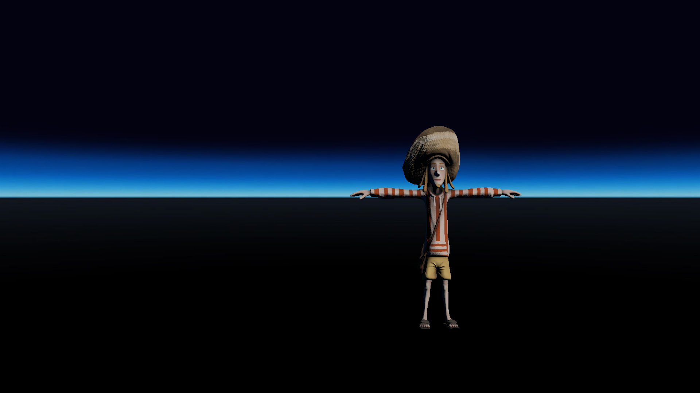
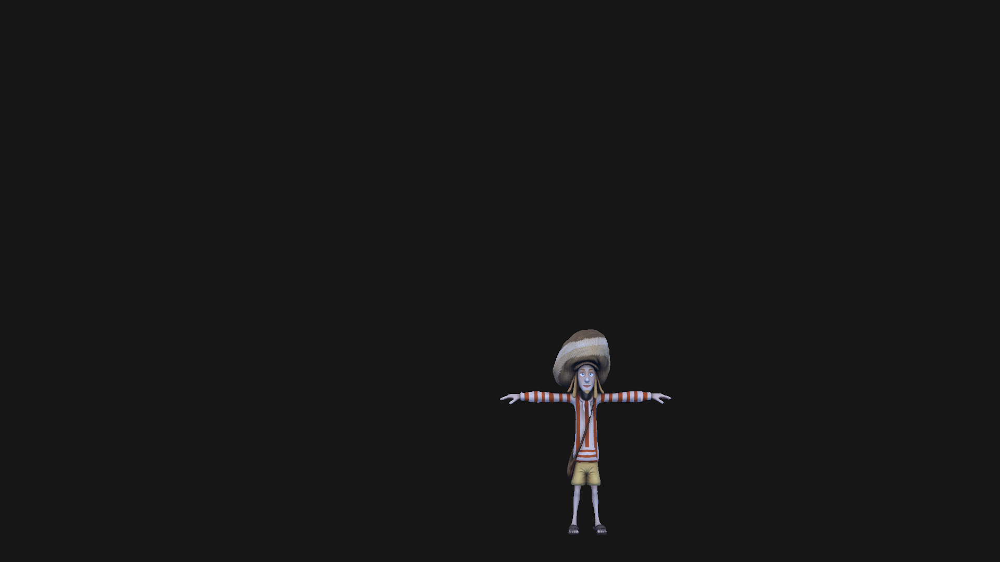

# LOD test
## Run this script URL: [Manual](./test.js?raw=true)   [Auto](./testAuto.js?raw=true)(from menu/Edit/Open and Run scripts from URL...).

## Preconditions
- In an empty region of a domain with editing rights.

## Steps
Press 'n' key to advance step by step

### Step 1
- Everything is visible
- 
### Step 2
- Set LOD to 50
### Step 3
- Backdrop partially visible
- 
### Step 4
- Set LOD to 10
### Step 5
- Just both models visible (in secondary)
- 
### Step 6
- Set LOD to 8.5
### Step 7
- Only right model visible (in secondary)
- 
### Step 8
- Clean up
