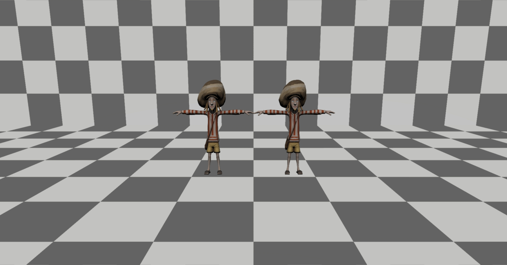

# Engine Controller isGroupCulled

### Preconditions
Interface is running.

### Steps

#### Step 1
- Run this [script URL](./isGroupCulled.js?raw=true) (from menu/Edit/Open and Run scripts From URL...).  You should see this:
- 

#### Step 2
- Use Developer -> Render -> LOD Tools to manually lower your LOD.  At some point, the eyes of the model on the left will
  disappear.  The eyes of the model on the right should continue rendering until the entire model disappears.