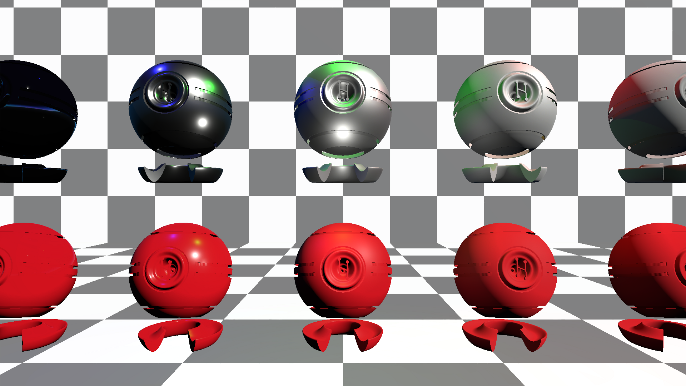

# Show effects of roughness
## Run this script URL: [Manual](https://raw.githubusercontent.com/highfidelity/hifi_tests/master/tests/engine/render/material/roughness/test.js)   [Auto](https://raw.githubusercontent.com/highfidelity/hifi_tests/master/tests/engine/render/material/roughness/testAuto.js)(from menu/Edit/Open and Run scripts from URL...).

## Preconditions
- In an empty region of a domain with editing rights.

## Steps
Press 'n' key to advance step by step

### Step 1
- Set up test case
### Step 2
- Turn off TAA for this test
### Step 3
- Take snapshot of the effects
- 
### Step 4
- Clean up after test
