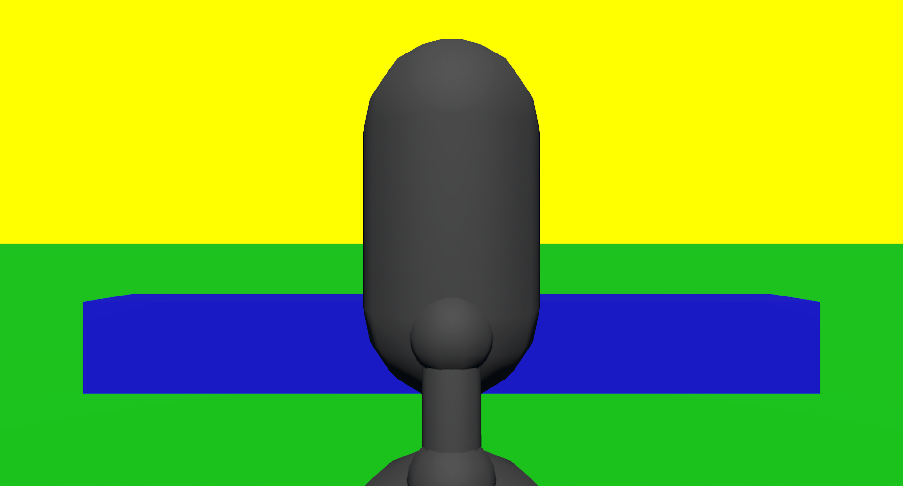
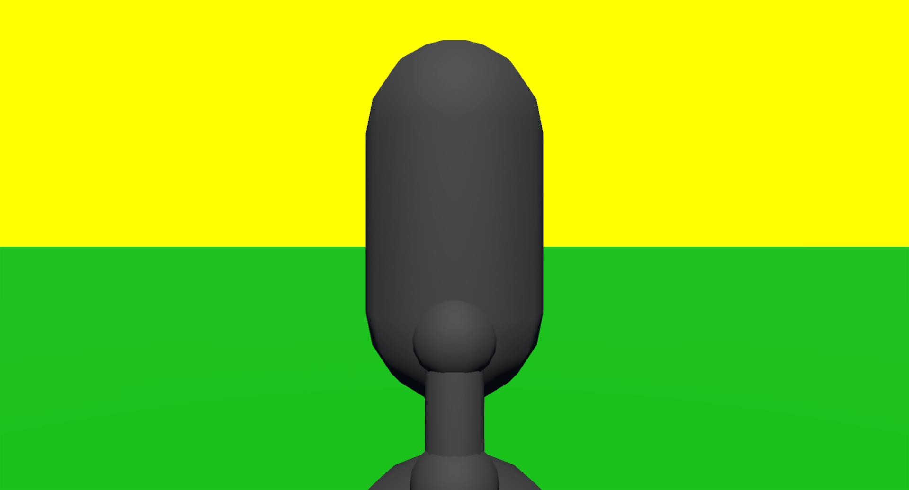

# MyAvatar scaling
## Run this script URL: [Manual](./test.js?raw=true)   [Auto](./testAuto.js?raw=true)(from menu/Edit/Open and Run scripts from URL...).

## Preconditions
- In an empty region of a domain with editing rights.

## Steps
Press 'n' key to advance step by step

### Step 1
- Setup avatar
### Step 2
- Set T-Pose
### Step 3
- Create zone and cube
### Step 4
- Scale = 1.0
- 
### Step 5
- Set scale to 2.0
### Step 6
- Scale = 2.0
- 
### Step 7
- Set scale to 0.5
### Step 8
- Scale = 0.5
- 
### Step 9
- Clean up after test
