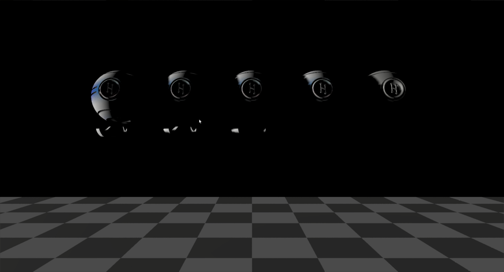

# Shadow - light at grazing angle from left
## Run this script URL: [Manual](./test.js?raw=true)   [Auto](./testAuto.js?raw=true)(from menu/Edit/Open and Run scripts from URL...).

## Preconditions
- In an empty region of a domain with editing rights.

## Steps
Press 'n' key to advance step by step

### Step 1
- Set up test case
### Step 2
- Show avatar if it is invisible (otherwise, shadows don't work correctly)
### Step 3
- Light source altitude: 5.0, azimuth: 90.0
- 
### Step 4
- Clean up after test, hiding avatar if it wasn't visible
