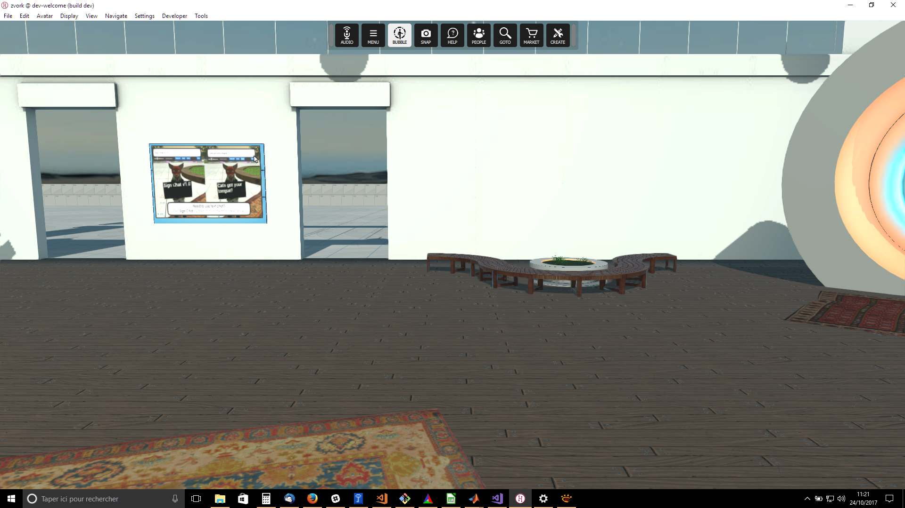
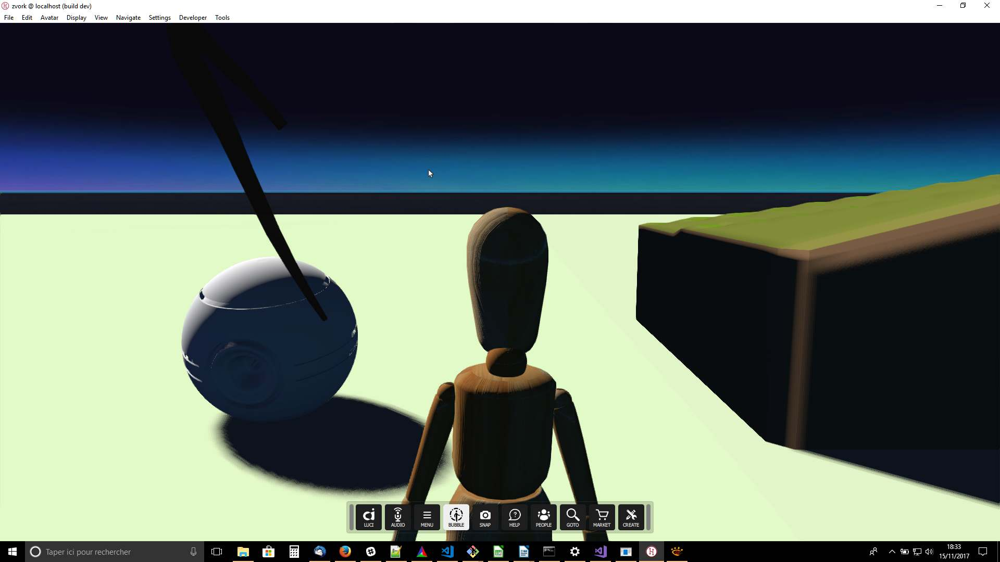
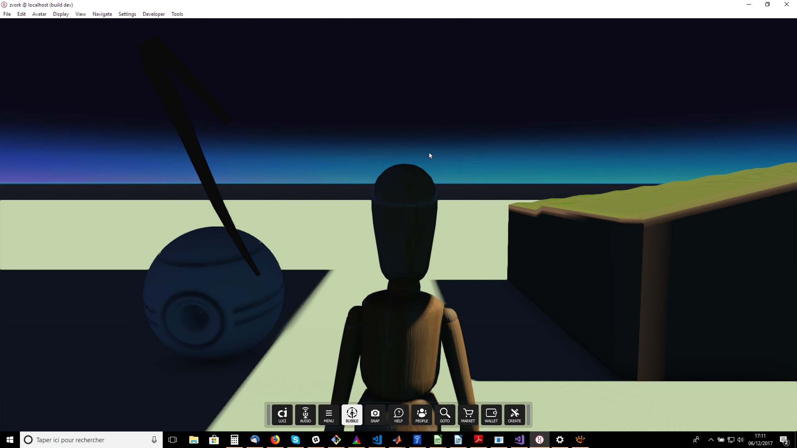
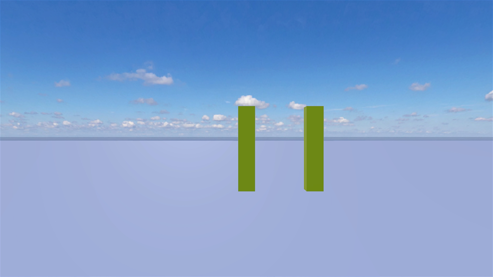
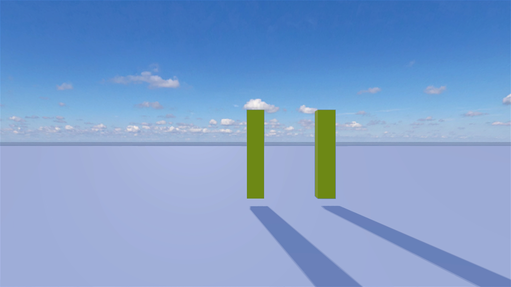
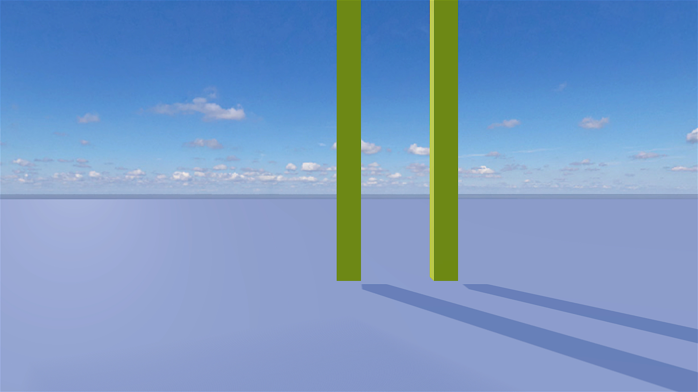
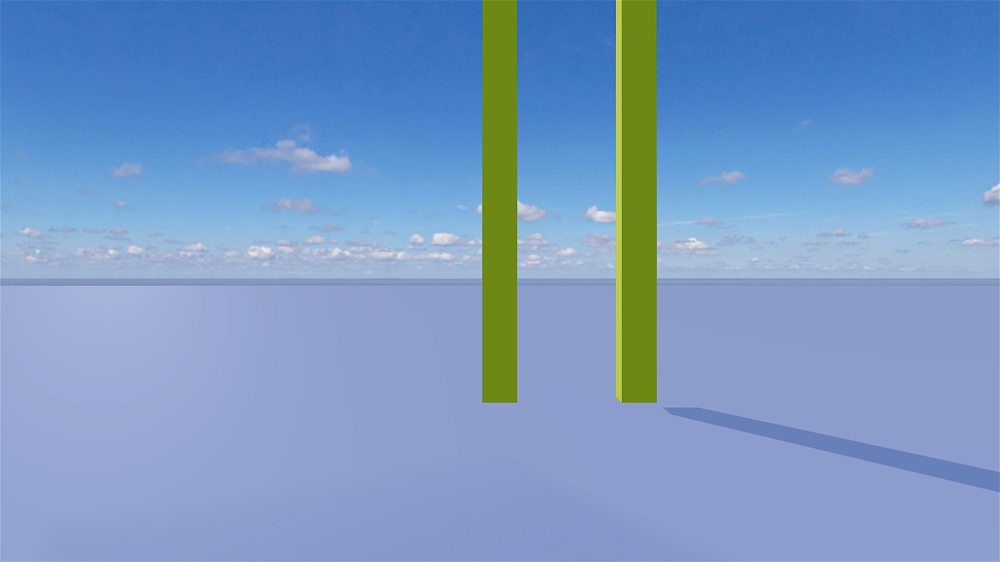

# Shadows
## Run this script URL: [Manual](./test.js?raw=true)   [Auto](./testAuto.js?raw=true)(from menu/Edit/Open and Run scripts from URL...).

<<<<<<< HEAD
### Preconditions
Interface is running, logged in an empty domain with editing rights and with avatar in first person view. This test should be performed with shadows enabled in Desktop and in HMD mode.
=======
## Preconditions
- In an empty region of a domain with editing rights.
>>>>>>> 14bdc2baed2c7de8e75b6162c733fbd7a2106a8b

## Platforms
Run the test on each of the following platforms
## Displays
Run the test on each of the following displays
## Processors
Run the test on each of the following processors
## Graphics Cards
Run the test on graphics cards from each of the following vendors
## Steps
Press space bar to advance step by step

<<<<<<< HEAD
Run the [shadows.js script](./shadows.js?raw=true) (from menu/Edit/Open and Run scripts From URL...) and playe each step in sequence by pressing the [SPACE] key.

#### Step 1
- Expected: 

#### Step 2
- Expected: 

#### Step 3
- Expected: 
=======
### Step 0
- Zone cast shadow flag is off - no shadows should be visible
### Step 1
- Enable shadows in the zone
- 
### Step 2
- Set the 'Light Altitude' to 10 and 'Light Azimuth' to 30
- 
### Step 3
- Remove shadow from one of the towers
- 
### Step 4
- Clean up after test
- 
>>>>>>> 14bdc2baed2c7de8e75b6162c733fbd7a2106a8b
