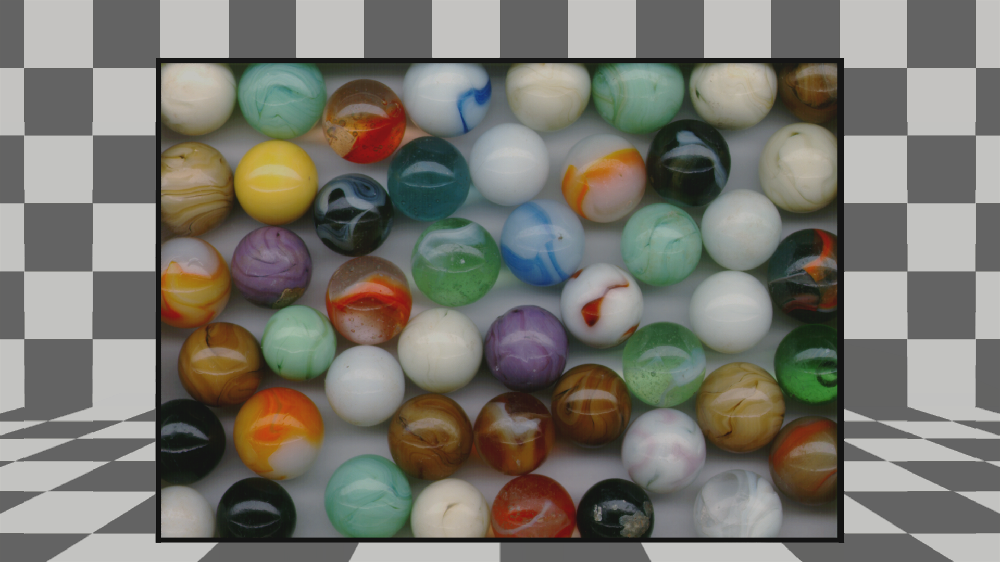
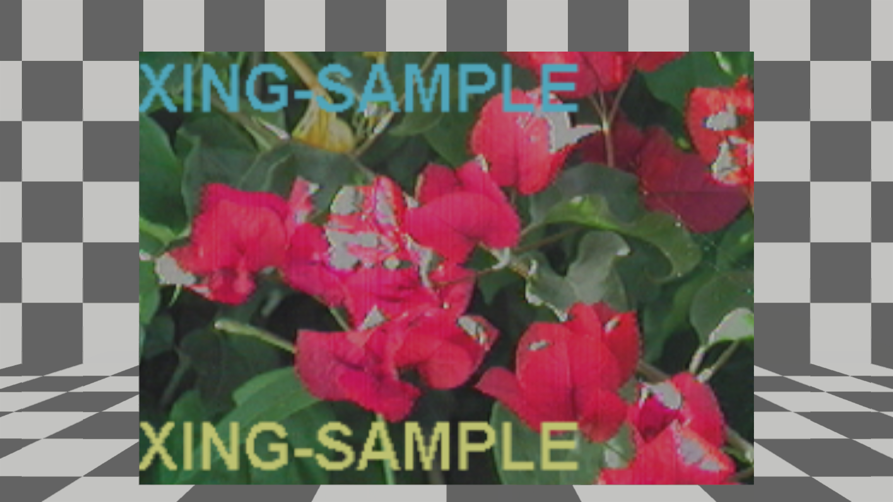
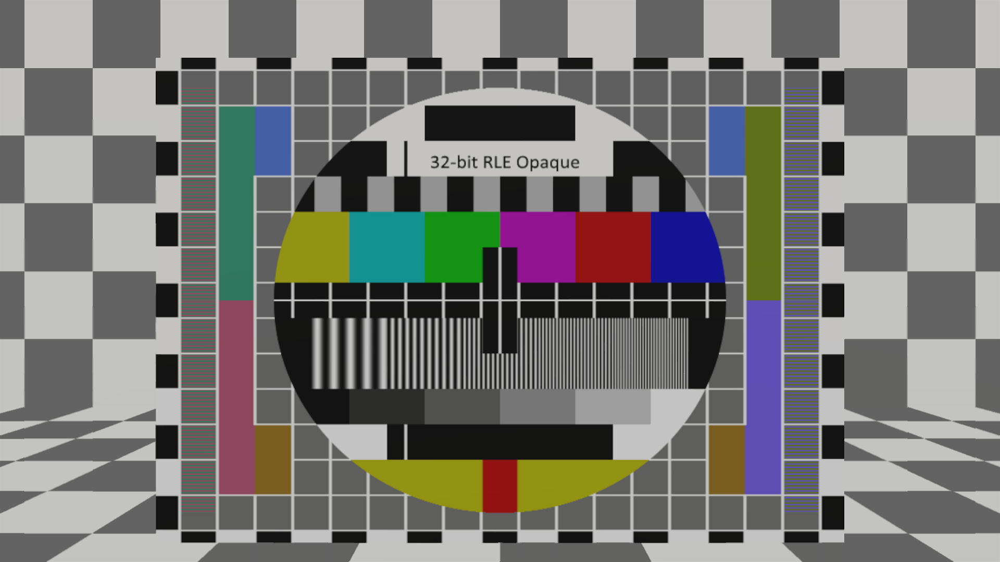
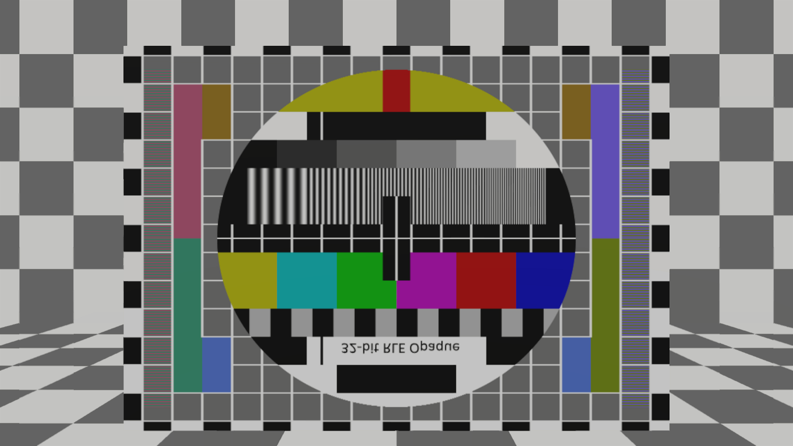

# TGA texture rendering
## Run this script URL: [Manual](./test.js?raw=true)   [Auto](./testAuto.js?raw=true)(from menu/Edit/Open and Run scripts from URL...).

## Preconditions
- In an empty region of a domain with editing rights.

## Steps
Press 'n' key to advance step by step

### Step 1
- First texture
- 
### Step 2
- Change texture
### Step 3
- Second texture
- 
### Step 4
- Change texture
### Step 5
- Third texture
- 
### Step 6
- Change texture
### Step 7
- Fourth texture
- 
### Step 8
- Change texture
### Step 9
- Fifth texture
- 
### Step 10
- Change texture
### Step 11
- Sixth texture
- 
### Step 12
- Change texture
### Step 13
- Seventh texture
- 
### Step 14
- Change texture
### Step 15
- Eight texture
- 
### Step 16
- Clean up after test
