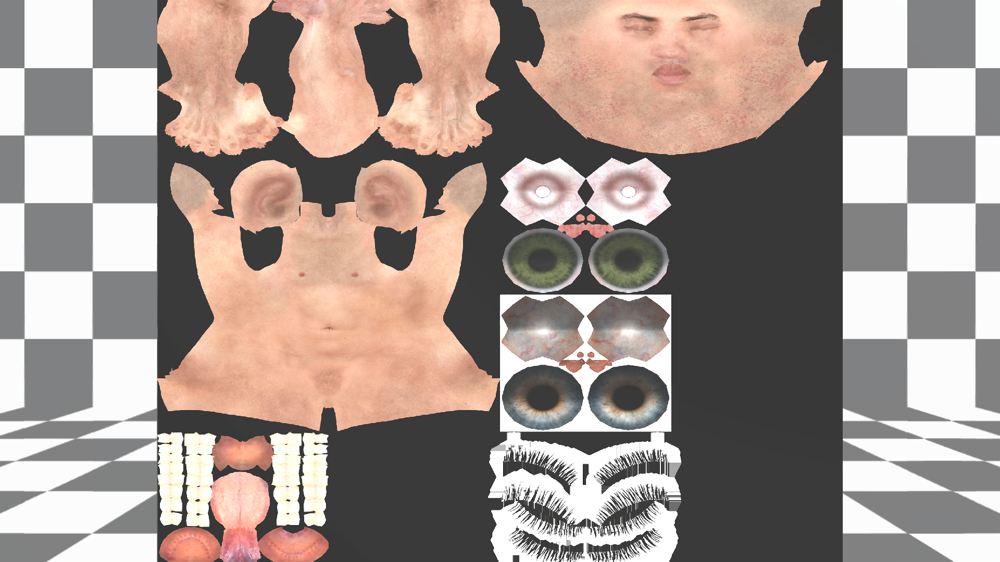
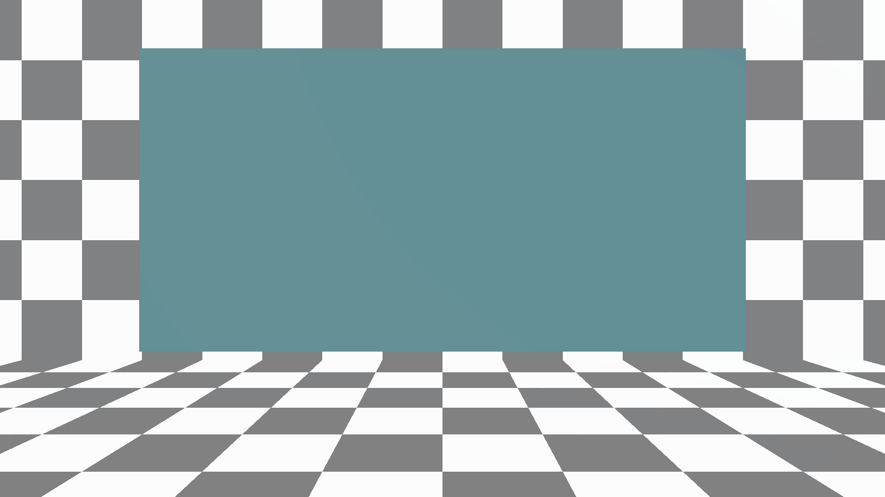

# Texture Rendering
## Run this script URL: [Manual](./test.js?raw=true)   [Auto](./testAuto.js?raw=true)(from menu/Edit/Open and Run scripts from URL...).

## Preconditions
- In an empty region of a domain with editing rights.

## Steps
Press 'n' key to advance step by step

### Step 1
- Set up scene
### Step 2
- Turn off TAA for this test
### Step 3
- Texture 
### Step 4
- Full Resolution
- 
### Step 5
- Update Mip 
### Step 6
- Mip 
- 
### Step 7
- Cleanup Texture
### Step 8
- Clean up after test
