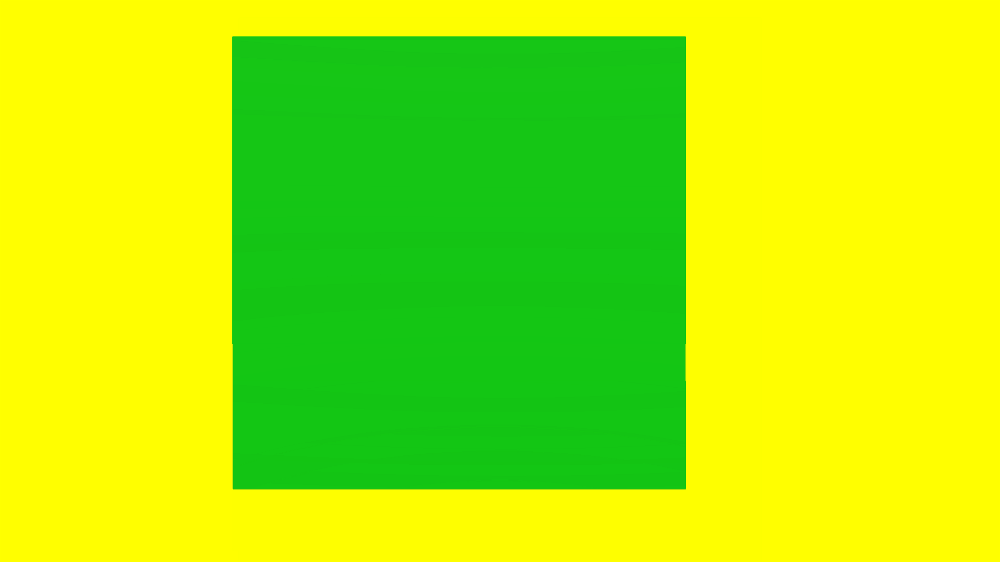

# 1 million triangles test
## Run this script URL: [Manual](./test.js?raw=true)   [Auto](./testAuto.js?raw=true)(from menu/Edit/Open and Run scripts from URL...).

## Preconditions
- In an empty region of a domain with editing rights.

## Steps
Press 'n' key to advance step by step

### Step 1
- Do not throttle FPS if not focus
### Step 2
- Create zone and hide the avatar mesh
### Step 3
- Add model with 1,000,000 triangles (appears in BOTH cameras)
### Step 4
- Wait for the model to load
### Step 5
- Measure rates
### Step 6
- Take snapshot of results overlay, and also save as a text file
### Step 7
- Prepare result box, green if passed, red if failed
### Step 8
- Take snapshot of results
- 
### Step 9
- Clean up after test
