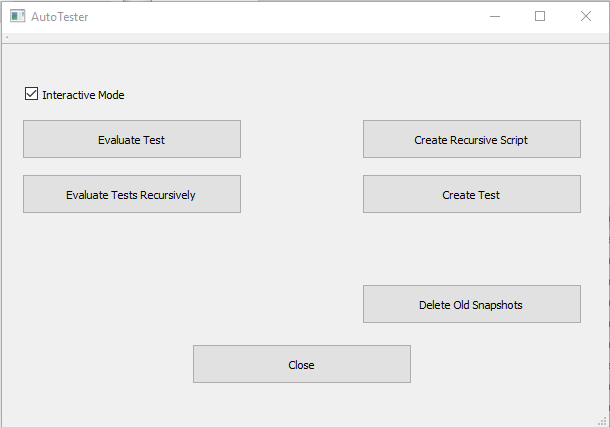

# Auto Tester

The auto-tester is a stand alone application that provides a mechanism for regression testing.  The general idea is simple:
* Each test folder has a script that produces a set of snapshots.
* The snapshots are compared to a 'canonical' set of images that have been produced beforehand.
* The result, if any test failed, is a zipped folder describing the failure.

Auto-tester has 4 functions, separated into 4 tabs:
1. Creating tests, MD files and recursive scripts
2. Evaluating the results of running tests
3. TestRail interface
4. Windows task bar utility (Windows only)
## Setup
### Windows 10
#### Tests Repository
* Clone the hifi_tests repository - this is not needed when to either run tests or evaluate their results.
```
git clone https://github.com/highfidelity/hifi_tests.git
```
#### Auto-Tester
1. Download the installer by browsing to [here](<https://hifi-content.s3.amazonaws.com/nissim/autoTester/AutoTester-Installer.exe>).
2. Double click on the installer and install to a convenient location  

3. To run the auto-tester, double click **auto-tester.exe**.
####

## Test File Content
### test.js
An automatic test is always named **test.js**.  This file contains a javascript module, as described below.  
#### test.js details
The **test.js** file itself has two requirements:
1. Export a parameterless function named `test`
2. Export a boolean named`complete`
    1. Initialized to false
    2. Set to true on completion of the test
    
In addition, the test hierarchy, only the test root may, and must, be named **tests**.  This is because the test needs to find the **tests/utils** folder.
    
A test expects an empty world and should end with an empty world, for the next test (if any).  The test should create a list of snapshots in the local folder.  The following code snippet describes one way of doing this.

```javascript
module.exports.complete = false;

module.exports.test = function (testType) {
    var TESTS_URL = "https://github.com/NissimHadar/hifi_tests/blob/NissimHadar/tests/";
    var SUFFIX = "?raw=true";
    var autoTester = Script.require(TESTS_URL + "utils/autoTester.js" + SUFFIX);
    var spectatorCameraConfig = autoTester.setupTests(Script.resolvePath("."));

    // Create the zone centered at the avatar position
    var pos = MyAvatar.position;

    // As a 5 meters cube box
    var dim = { x: 5.0, y: 5.0, z: 5.0};

    // Define zone properties
    var properties = {
        lifetime: 60,  
        type: "Zone",  
        name: "test create zone",
        position: pos,
        dimensions: dim,
        keyLight:{"color": {"red":0,"green":255,"blue":0}},
        
        skyboxMode: "enabled",
        skybox:{"color":{"red":0,"green":0,"blue":255}}
    };
    var zone = Entities.addEntity(properties);

    // An array of tests is created.  These may be called via the timing mechanism for auto-testing,
    // or stepped through with the space bar
    var steps = [
        function () {
            spectatorCameraConfig.position = {x: pos.x, y: pos.y + 0.6, z: pos.z};
        },
        
        // Take snapshot
        function () {
        },
        
        // Clean up after test
        function () {
            Entities.deleteEntity(zone);
            module.exports.complete = true;
        }
    ]
    
    var result = autoTester.runTests(testType, steps);
};
```
## Using the auto-tester
The auto-tester provides the following 5 functions:
1. Evaluate a single test
2. Evaluate tests recursively
3. Create a recursive test script
4. Create a test case
5. Delete old snapshots



Each of the 4 functions asks the user to select a folder.

## Evaluation - general
A checkbox is provided for de-selecting interactive mode.  If this checkbox ix selected then each error will be displayed to the user; otherwise, the evaluation will procede till completion.  In both cases, all errors are logged to file.
For each failed test, a zipped folder is created within the test folder, named *TestResults*.  This folder contains a folder for each failed test named *Failure_n*, numbered sequentially.  Each folder contains 4 files:
1. Expected Image
2. Actual Image
3. Difference Image
4. TestResults - a text file providing details of the test folder, the original image names, and the size of the mismatch.
### Evaluate Test
Evaluating a test is performed after running a **test.js** script to create new snapshots.  After selecting the folder, the images are compared in lexical order.  If the similarity between any image pair does not pass a fixed threshold, the image pair is displayed and the user can select to accept the difference, fail this specific test case, or abort testing.

### Evaluate Tests Recursively
This is a recursive version of the previous function.  Auto-tester will recurse through all folders from the selected folder.  A test will be evaluated if the following is true:
* The folder contains a **test.js** script
* The number of actual and expected snapshots is the same (see Create Test for an explanation)
### Create a recursive test script
Auto-tester will create a script named **allTests.js** that will call all **test.js** scripts found in the folder, and any subfolders.  An example of the script created is:
```
// This is an automatically generated file, created by auto-tester
var test1 = Script.require("file:///D:/GitHub/hifi-tests/tests/content/entity/zone/ambientLightInheritance/test.js");
var test2 = Script.require("file:///D:/GitHub/hifi-tests/tests/content/entity/zone/create/test.js");
var test3 = Script.require("file:///D:/GitHub/hifi-tests/tests/content/entity/zone/createMultipleZones/test.js");

var test1HasNotStarted = true;
var test2HasNotStarted = true;
var test3HasNotStarted = true;

// Check every second if the current test is complete and the next test can be run
var testTimer = Script.setInterval(
    function() {
        if (test1HasNotStarted) {
            test1HasNotStarted = false;
            test1.test();
            print("******started test 1******");
        }

        if (test1.complete && test2HasNotStarted) {
            test2HasNotStarted = false;
            test2.test();
            print("******started test 2******");
        }

        if (test2.complete && test3HasNotStarted) {
            test3HasNotStarted = false;
            test3.test();
            print("******started test 3******");
        }

        if (test3.complete) {
            print("******stopping******");
            Script.stop();
        }

    },

    1000
);

// Stop the timer and clear the module cache
Script.scriptEnding.connect(
    function() {
        Script.clearInterval(testTimer);
        Script.require.cache = {};
    }
);
```
### Create a Test Case
A test case is created after running the test script.  Running the script produces a series of snapshots, named **hifi-snap-by-**_user name_**-on-YYYY-MM-DD_HH-MM-SS.jpg**.  This function simply renames these files to **ExpectedImage_1.jpg**, **ExpectedImage_2.jpg** and so on.  These files can be added to version control as they are a fixed asset of the test.
### Delete old snapshots
This button recursively deletes all snapshots created for testign (not the Expected Images).
